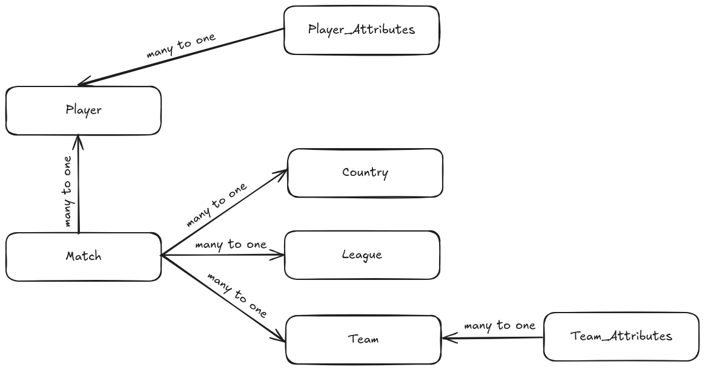

# Predicting the outcome of Soccer Matches using Machine Learning

# Opis projekta

Projekat je izradjen u okviru kursa Mašinsko učenje na master studijama Matematičkog fakulteta u Beogradu.Ovaj projekat se bavi problemom predvidjanja rezultata fudbalskih mečeva u Evropi, primenom različitih algoritama mašinskog učenja, čiji rezultati su potom i uporedjenji. Ovaj problem je problem višeklasne klasifikacije, a propratne poteškoće su nebalansiranost i velika količina podataka koji ne utiču na ishod utakmice u okviru podataka koji su korišćeni u okviru projekta.

# Opis skupa podataka

1. **Skup podataka :** 
   - [Soccer database](https://www.kaggle.com/datasets/hugomathien/soccer)

2. **Opis:**
   - Dati skup podataka opsuje fudbalske utakmice odigrane u Evropi. To je učinjeno kroz kroz 7 relacionih tabela, koje sadrže podatke o mečevima, ligama, zemljama, igračima, atributima igrača, timovima i atributima timova. Kako je cilj ovog projekta predvidjanje rezultata mečeva, kao glavna tabela u okviru projekta je korišćena tabela mečevi, koja je potom putem stranih ključeva, koji su definisani u bazi podataka, izpovezivana sa drugim tabelama. Ispod možete pogledati idejno kako izgleda opisana baza podtaka.
     

# Korišćena literatura
https://github.com/thomas-brink/CS229-Project/blob/main/CS229_Project_Report.pdf

# Instalacije i testiranje
Sve potrebne biblioteke koje su korišćene u toku izrade projekta se nalaze u `requirements.txt`, i to možete uraditi pokretanjem sledećih komande:

```
sudo apt-get update
sudo apt-get install python3.8
sudo apt-get install python3-pip
python3.8 -m pip install -r requirements.txt
```
### Testiranje:

U direktorijumu `./src` pokrenuti sledeće komande:

```jupyter notebook```

i zatim pokretati ćelije sveski u redosledu označenim u imenima fajlova.

# Projekat izradila:
Mirjana Jočović 1079/2022
